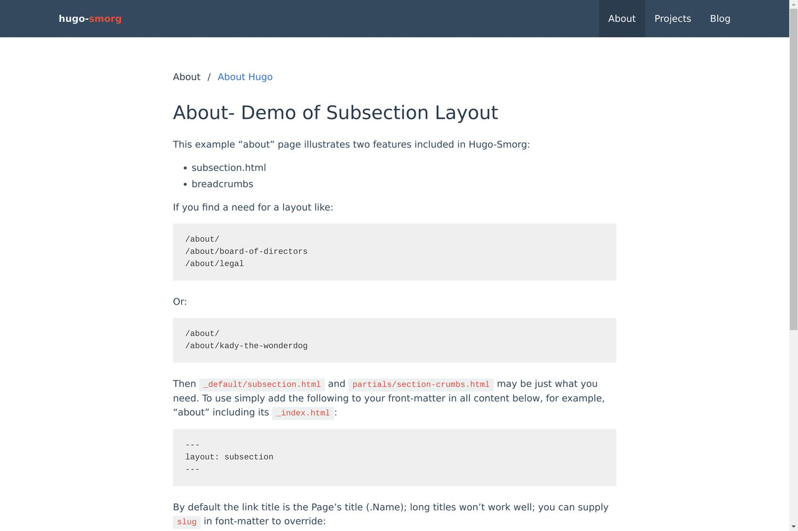

## /bin

* hugodev.sh, a shell script that will grab your first _non-localhost_ adapter
  and bind `hugo server` to it; handy when developing and you need browsers on
  other machines (real or virtual).

## /partials

* pagination-bulma.html; [Bulma][] themed pagination. [screenshot 1](screenshots/pagination-bulma1.jpg), [screenshot 2](screenshots/pagination-bulma2.jpg)
* section-crumbs.html; Provides breadcrumb navigation for section (and contents). 

[Bulma]: https://bulma.io/
